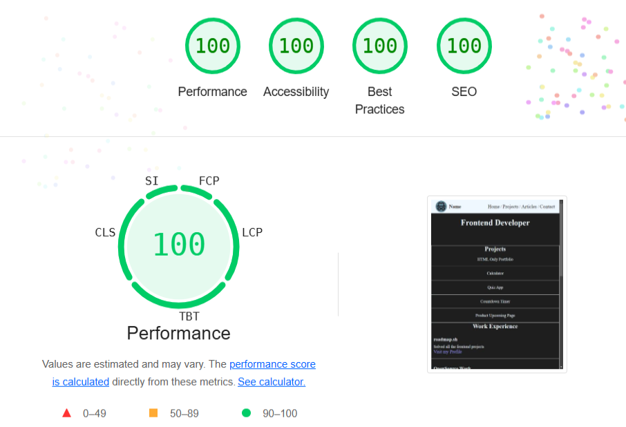

# Personal Portfolio

This is a solution to the [Personal Portfolio on roadmap.sh](https://roadmap.sh/projects/portfolio-website).

## Overview

### The challenge

Make the layout the same as the mockup provided below:

### Requirements
- A fully styled, responsive website.
- Consistent use of a chosen color scheme and typography.
- Proper use of CSS techniques like Flexbox, media queries, and the box model.
- A responsive navigation bar and well-styled contact form.

## Result

### Screenshots

###### Light Theme

###### Dark Theme

### Metrics

Analyze the web using Lighthouse version 100.0.0.4, extension of Google Chrome version 131.0.6778.205

###### Lighthouse Report screenshot

